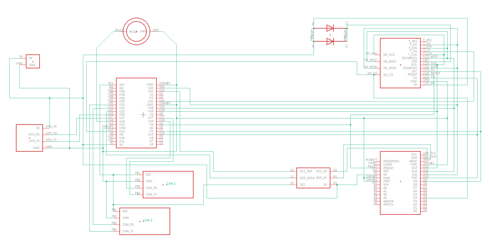

# CAN ESP32

## verwendete Bauteile

- ESP32 Development Board (z.B. https://www.amazon.de/gp/product/B071P98VTG)
- 2,8 Zoll 240 x 320 SPI TFT Panel resistiver Touchscreen (ILI9341, https://www.amazon.de/gp/product/B0749N3S33/)
- alternativ mit kapazitivem Touchscreen (ILI9341, https://www.amazon.de/gp/product/B00R3R65C0/)
- CAN Transceiver SN65HVD230 (z.B. https://www.amazon.de/gp/product/B00KM6XMXO/)
- evtl. bei Versorgung über CAN Bus: Spannungsregler 12V -> 5V (z.B. https://www.amazon.de/gp/product/B01B7EEWGK/)
- GPS-Modul (z.B. https://www.amazon.de/gp/product/B01N38EMBF/)
- Bei Verwendung des kapazitiven Displays: Level Shifter 3V3 <-> 5V (für SDA und SCL)
- Kleinteile (CAN-Stecker für OBD Buchse, Ein/Ausschalter, etc)

## Verbindungen mit resistivem Touch Screen
<pre>
ESP32 Dev Board Pinout

Wohin       Bezeich.       ESP32 Pins       Bezeich.    Wohin

Display,CAN             3V3         GND
                        EN          G23     MOSI        Display,Touch,SD
            ST          G36         G22
                        G39         G1      (TX)
                        G34         G3      (RX)
            (CAN2 RX)   G35         G21     CS          Touch
            (CAN2 TX)   G32         GND
                        G33         G19     MISO        Display,Touch,SD
                        G25         G18     SCLK        Display,Touch,SD
GPS         GPS TX      G26         G5 
GPS         GPS RX      G27         G17     CAN TX      CAN Bus
BUZZER+                 G14         G16     CAN RX      CAN Bus 
                        G12         G4      RST         Display
Display,CAN,GPS         GND         G0      (BOOT)
SD          CS          G13         G2      DC          Display
            (Flash)     G9          G15     CS          Display
            (Flash)     G10         G8      (Flash)
            (Flash)     G11         G7      (Flash)
GPS                     5V          G6      (Flash)
</pre>                    
RX und TX gibt den Pin an, mit dem es verbunden werden muss. GPS TX muss also auf den Pin
TX am GPS Modul! 

CAN2 ist derzeit experimentell. 

ST = Screen Turn, ST=1 (mit 10k auf 3V3) -> Bildschirm um 180 Grad gedreht

## Verbindungen mit kapazitivem Touch Screen
<pre>
ESP32 Dev Board Pinout

Wohin       Bezeich.       ESP32 Pins       Bezeich.    Wohin

CAN                     3V3         GND
                        EN          G23     SPI MOSI    Display
            ST          G36         G22     I2C SCL     Display
                        G39         G1      (TX)
                        G34         G3      (RX)
            (CAN2 RX)   G35         G21 
            (CAN2 TX)   G32         GND
Display     HR          G33         G19     SPI MISO    Display
Display     I2C SDA     G25         G18     SPI SCLK    Display
GPS         GPS TX      G26         G5
GPS         GPS RX      G27         G17     CAN TX      CAN Bus
BUZZER+                 G14         G16     CAN RX      CAN Bus 
                        G12         G4      RST         Display
Display,CAN,GPS         GND         G0      (BOOT)
Display     CARDCS      G13         G2      DC          Display
            (Flash)     G9          G15     CS          Display
            (Flash)     G10         G8      (Flash)
            (Flash)     G11         G7      (Flash)
GPS,Display             5V          G6      (Flash)
</pre>                    
Die beiden Leitungen für den I2C Bus (SCL und SDA) müssen über einen Level Shifter geführt 
werden (sowohl ESP32 als auch das Display arbeiten mit Pull Ups auf VCC. Der ESP32 allerdings 
mit 3.3 Volt, das Display mit 5 Volt. Würde nicht ausprobieren wollen, wer ohne Level Shifter gewinnt...)
RX und TX gibt den Pin an, mit dem es verbunden werden muss. GPS TX muss also auf den Pin
TX am GPS Modul! 

CAN2 ist derzeit experimentell. 

ST = Screen Turn, ST=1 (mit 10k auf 3V3) -> Bildschirm um 180 Grad gedreht

HR = Helligkeitsregelung, an Pin GPIO33 liegt ein PWM Signal an, welches über Pin D5 am Display
(neben CARDCS) die Regelung der Displayhelligkeit erlaubt. Achtung: Die Lötbrücke #5 auf der 
Displayplatine muss hierfür gesetzt werden.

## Schaltplan

Rechts sind die beiden (alternativen) Displays, oben resistiv, unten kapazitiv. Nur eine der beiden 
Möglichkeiten wird verbaut.
                    
## Allgemein
-  Das Display mit resistivem Touch Screen erhält 3V3 auf VCC (Versorgungsspannung) und LED (Hintergrundbeleuchtung). Beim Betrieb
des Displays mit 3.3V sollte der Jumper J1 am Display gesetzt (verbunden) werden (Ausschalten
des Spannungsreglers des Displays, sonst sinken die 3.3V auf irgendwas unter 3V). Der 
Touch IRQ Pin bleibt leer.
- Das Display mit kapazitivem Touch Screen erhält 5V Versorgungsspannung
